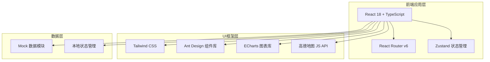

# 综合业务分析系统 — 前端技术架构文档

## 1. 架构设计



## 2. 技术选型

| 维度 | 技术方案 | 说明 |
|------|----------|------|
| 前端框架 | React 18 + TypeScript | 组件化开发，类型安全 |
| 构建工具 | Vite 5 | 快速热更新，高效构建 |
| UI组件库 | Ant Design 5 | 企业级组件，中文友好 |
| 样式方案 | Tailwind CSS 3 | 原子化CSS，快速布局 |
| 图表库 | ECharts 5 | 丰富图表类型，大数据渲染 |
| 地图 | 高德地图 JS API 2.0 | 国内地图服务，GIS功能完善 |
| 状态管理 | Zustand | 轻量级，模块独立 |
| 路由 | React Router v6 | 嵌套路由，懒加载 |
| 动画 | Framer Motion | 流畅过渡动画 |
| 图标 | Lucide React | 统一线性图标风格 |
| 日期 | dayjs | 轻量日期处理 |
| 模拟数据 | 本地 JSON + Faker | 前端内嵌假数据 |

## 3. 路由定义

| 路由路径 | 页面 | 说明 |
|----------|------|------|
| `/` | 综合驾驶舱 | 首页大屏，全县治理总览 |
| `/video` | 视频资源管理 | 设备列表、预览、回放、地图 |
| `/video/preview/:id` | 视频预览详情 | 单路/多路视频预览 |
| `/video/playback/:id` | 录像回放 | 历史录像回放 |
| `/video/map` | 设备地图 | GIS地图展示设备分布 |
| `/analysis` | 行为分析 | 分析任务管理 |
| `/analysis/tasks` | 分析任务列表 | 任务增删改查 |
| `/analysis/realtime` | 实时分析监控 | 运行中任务监控 |
| `/analysis/results` | 分析结果查询 | 历史结果检索 |
| `/warning` | 预警中心 | 预警列表与处置 |
| `/warning/rules` | 预警规则配置 | 规则增删改查 |
| `/warning/stats` | 预警统计 | 统计图表 |
| `/urban` | 城管业务协同 | 案件管理 |
| `/urban/cases` | 案件列表 | 案件增删改查 |
| `/urban/patrol` | 智能巡查 | AI巡查事件 |
| `/urban/stats` | 案件统计 | 统计图表 |
| `/emergency` | 应急指挥调度 | 应急管理 |
| `/emergency/map` | 资源一张图 | GIS资源展示 |
| `/emergency/plans` | 预案管理 | 预案增删改查 |
| `/emergency/review` | 应急复盘 | 事件回放 |
| `/address` | 门牌管理 | 地址与门牌 |
| `/address/standard` | 标准地址库 | 地址列表管理 |
| `/address/plate` | 门牌编码 | 门牌号管理 |
| `/address/qrcode` | 二维码门牌 | 二维码生成预览 |
| `/collection` | 一标三实核采 | 核采管理 |
| `/collection/tasks` | 核采任务 | 任务管理 |
| `/collection/population` | 实有人口 | 人口核采 |
| `/collection/house` | 实有房屋 | 房屋核采 |
| `/collection/unit` | 实有单位 | 单位核采 |
| `/collection/flow` | 流动人口 | 流动人口管理 |
| `/collection/quality` | 数据质量 | 质量管控 |
| `/collection/relation` | 数据关联 | 关联融合可视化 |
| `/grid` | 网格化管理 | 网格管理 |
| `/grid/division` | 网格划分 | GIS网格编辑 |
| `/grid/staff` | 网格员管理 | 人员管理 |
| `/grid/tasks` | 任务分派 | 任务管理 |
| `/grid/events` | 网格事件 | 事件上报 |
| `/grid/performance` | 网格绩效 | 绩效考核 |
| `/grid/mobile` | 移动工作台 | 移动端模拟 |
| `/report` | 报表中心 | 报表管理 |
| `/report/list` | 报表列表 | 报表查看导出 |
| `/report/custom` | 自定义报表 | 维度组合查询 |
| `/report/drill` | 数据下钻 | 逐级下钻分析 |

## 4. 项目目录结构

```
src/
├── components/          # 公共组件
│   ├── Layout/          # 布局组件（侧边栏、顶栏、面包屑）
│   ├── Charts/          # 图表封装组件
│   ├── Map/             # 地图封装组件
│   └── Common/          # 通用业务组件
├── pages/               # 页面组件（按模块独立）
│   ├── Dashboard/       # 综合驾驶舱
│   ├── Video/           # 视频资源管理
│   ├── Analysis/        # 行为分析
│   ├── Warning/         # 预警中心
│   ├── Urban/           # 城管业务协同
│   ├── Emergency/       # 应急指挥调度
│   ├── Address/         # 门牌管理
│   ├── Collection/      # 一标三实核采
│   ├── Grid/            # 网格化管理
│   └── Report/          # 报表中心
├── mock/                # 模拟数据（按模块独立）
│   ├── devices.ts       # 设备数据
│   ├── warnings.ts      # 预警数据
│   ├── urbanCases.ts    # 城管案件数据
│   ├── addresses.ts     # 地址数据
│   ├── collection.ts    # 一标三实数据
│   ├── grid.ts          # 网格数据
│   └── stats.ts         # 统计数据
├── stores/              # 状态管理（按模块独立）
├── router/              # 路由配置
├── styles/              # 全局样式与主题
├── utils/               # 工具函数
├── App.tsx              # 应用入口
└── main.tsx             # 渲染入口
```

## 5. 模块独立开发策略

每个功能模块遵循以下独立开发原则：

1. **独立路由**：每个模块有独立的路由前缀和路由配置
2. **独立数据**：每个模块的 mock 数据独立文件，互不依赖
3. **独立状态**：每个模块使用独立的 Zustand store
4. **独立组件**：模块内组件不跨模块引用，公共组件抽取到 components/
5. **懒加载**：各模块页面使用 React.lazy 按需加载

## 6. 主题配置

```typescript
// 主题色定义
const theme = {
  colors: {
    bgPrimary: '#0A1628',      // 主背景
    bgSecondary: '#1B3A5C',    // 卡片背景
    bgTertiary: '#0D2137',     // 侧边栏背景
    accent: '#00D4FF',         // 科技蓝强调
    accentGreen: '#00FF88',    // 正常/在线
    accentOrange: '#FF9500',   // 预警/待处理
    accentRed: '#FF3B5C',      // 告警/紧急
    accentPurple: '#A855F7',   // 数据/分析
    textPrimary: '#E8F0FE',    // 主文字
    textSecondary: '#8BA3C7',  // 次要文字
    border: '#1E3A5F',         // 边框
  }
}
```
